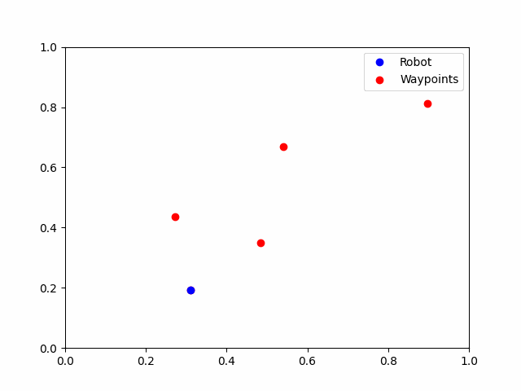

<!--
 * @Author: LOTEAT
 * @Date: 2024-08-18 11:52:33
-->
<!--
 * @Author: LOTEAT
 * @Date: 2024-07-31 11:21:01
-->
## Minimum Snap Demo

This branch is to optimize the physical variables instead of polynomial coefficients. If you want to know more about `Minimum Snap Model`, you can read [this paper](https://ieeexplore.ieee.org/stamp/stamp.jsp?tp=&arnumber=5980409).

### 1. Minimum Snap Model
I write a blog about this paper in Chinese. You can read [this blog](https://github.com/LOTEAT/PaperReading/blob/main/MotionPlanning/TrajectoryGeneration/MinimumSnap/minimum_snap.md) to understand this model.


### 2. Code
#### 2.1 Quadratic Matrix
In this branch, we want to optimize the polynomial coefficients to minimize the loss function. The loss function is 
$$
L(p) = \sum_{i=1}^mJ_i^2(T_i)
$$
where $L(p)$ is the loss when polynomial coefficients are $p$. Note that there are many segments (suppose that the number of segments are $m$), therefore $p = [p_{n1},p_{(n-1)1}, ..., p_{21}, p_{11}, p_{01}, ..., p_{nm}, p_{(n-1)m}, ..., p_{2m}, p_{1m}, p_{00}]^T$. $p_{ij}$ is the $j$-th coefficient of $i$-th segment. And the order of the polynomial function is $n$, which means that trajectory function $f(x)=\sum_{i=0}^np_i x^i$.

$J_i^2(T_i)$ is the square of snap of $i$-th segment  for a duration of $T_i$. 

For the loss of $i$-th segment, $L_i({p_i}) = J_i^2(T_i)$. Note that
$$
S_i(t) = f_i^{(4)}(t)=\sum_{k \geq 4} k(k-1)(k-2)(k-3) t^{k-4} p_{ki}
$$
And $S_i$ is the snap of $i$-th segment.
The square of $S_i$ is
$$
\begin{aligned}
S_i^2(t) & = f_i^{(4)}(t)^2 \\
& =\sum_{k \geq 4, l \geq 4} k(k-1)(k-2)(k-3) l(l-1)(l-2)(l-3) t^{k+l-8} p_{ki} p_{li} \\
\end{aligned}
$$
For now, we can easily calculate $J_i^2(T_i)$, which is 
$$
\begin{aligned}
J(T)&=\int_{0}^{T_i}\left(f_i^4(t)\right)^2 dt \\
&=\sum_{k \geq 4, l \geq 4} \frac{k(k-1)(k-2)(k-3) l(l-1)(l-2)(l-3)}{k+l-7}T_i^{k+l-7} p_{ki} p_{li}\\
&=\left[\begin{array}{c}
p_{ni} \\
\vdots \\
p_{ki} \\
\vdots \\
p_{0i}
\end{array}\right]^T\left[\begin{array}{ccc}
&&\vdots \\
 &\ldots & \frac{k(k-1)(k-2)(k-3) l(l-1)(l-2)(l-3)}{k+l-7} T_i^{k+l-7} & \ldots \\
& & \vdots & 
\end{array}\right]\left[\begin{array}{c}
p_{ni} \\
\vdots \\
p_{li} \\
\vdots \\
p_{0i} \\
\end{array}\right] \\
& =\left[\begin{array}{c}
p_{ni} \\
\vdots \\
p_{ki} \\
\vdots \\
p_{0i}
\end{array}\right]^T Q_i \left[\begin{array}{c}
p_{ni} \\
\vdots \\
p_{li} \\
\vdots \\
p_{0i}
\end{array}\right] \\
\end{aligned}
$$

Note that in the minimum snap model, we convert this problem to a quadratic convex optimization problem. The format should be
$$
\min_{\substack{p}} L(p) = p^T Q p + f^T p
$$
In our problem, there is no $f^Tp$, therefore $f=[0,0,...,0]^T$. Note that
$$
 Q = \left[
 \begin{matrix}
   Q_1 &  &  & &\\
    & Q_2 &  & &\\
    &  & Q_3 & & \\
    &  &  & \ddots & \\
    &  &  &  & Q_m
  \end{matrix}
  \right]
$$

You can calculate the $Q_i$ matrix by using loops, but in my implementation, I decompose this matrix.
We can decompose the numerator and denominator. 
For the denominator `scale_mat`, we can calculate it by
$$
scale\_mat_{(n-3)\times(n-3)} = \left[\begin{array}{ccc}
& 2n-7 & 2n-6 & \dots & n-3 \\
& 2n-6 & 2n-5 & \dots & n-4 \\
& \vdots & \vdots & \dots & \vdots \\
& n-3 & n-4 & \dots & 1 \\
\end{array}\right]
$$
Using `scale_mat`, we can easily calculate `T` matrix, which is 
$$
T = T_i^{scale\_mat}
$$
For the numerator `coef_mat`, we can decompose it to the multiplication of two vectors, which is
$$
coef\_mat = \left[\begin{array}{ccc}
C(n) &C(n-1)& C(n-2)& \dots& C(4)
\end{array}\right]^T\left[\begin{array}{ccc}
C(n) &C(n-1)& C(n-2)& \dots& C(4)
\end{array}\right]
$$
Here we define a function $C(x) = x(x-1)(x-2)(x-3)$. Using `scale_mat`, `coef_mat` and `T`, we can easily calculate the $Q_i$ matrix.
Here is my implementation.
```python
    def initialize(self):
        # calculate the coef_mat and scale_mat
        coef_func = lambda x: x * (x - 1) * (x - 2) * (x - 3)
        coef_mat = np.zeros((self.n_order + 1, self.n_order + 1))
        scale_mat = np.ones((self.n_order + 1, self.n_order + 1))

        coef_vec1 = np.array(
            [coef_func(i) for i in range(self.n_order, 3, -1)]).reshape(-1, 1)
        coef_vec2 = np.array(
            [coef_func(i) for i in range(self.n_order, 3, -1)]).reshape(1, -1)
        coef_mat[:self.n_order - 3, :self.n_order - 3] = coef_vec1 @ coef_vec2

        scale_mat_list = []
        for _ in range(self.n_order - 3):
            if len(scale_mat_list) == 0:
                scale_mat_list.append(
                    np.array(list(range(2 * self.n_order - 7, self.n_order - 4, -1))))
            else:
                scale_mat_list.append(scale_mat_list[-1] - 1)
        scale_mat[:self.n_order - 3, :self.n_order - 3] = np.array(scale_mat_list)

        return coef_mat, scale_mat
```
```python
    def get_quadratic_matrix(self):
        # calculate quadratic matrix
        Q = []
        for i in range(self.n_seg):
            seg_time = self.seg_time[i]
            T_mat = seg_time**self.scale_mat
            seg_Q = self.coef_mat * T_mat / self.scale_mat
            Q.append(seg_Q)
        return block_diag(*Q)
```
#### 2.2 Mapping Matrix
We hope to find a matrix to map polynomial coefficients to physical variables, like $p, v, a, j$. It means that we need to find a matrix $M$, and using $M$ we can get $d=Mp$. $d = \left[\begin{array}{c}p^{start}_1  & v^{start}_1 & a^{start}_1 & j^{start}_1 \dots & p^{end}_{m} & v^{end}_{m} & a^{end}_{m} & j^{end}_{m} \end{array}\right]^T$. Totally we have $2m$ variables.

I would like to calculate a matrix $A$, using $A$ and $p$ we can easily calculate the position $p$, velocity $v$, acceleration $a$, and jerk $j$, which is 
$$
\begin{aligned}
\left[\begin{array}{cccc}
p& v& a &j 
\end{array}\right]^T & = Ap \\
& = A \left[\begin{array}{cccc}
p_n& p_{n-1}& \dots & p_0 
\end{array}\right]^T
\end{aligned}
$$

And we know that
$$
\begin{aligned}
p & = \sum_{i=0}^np_it^i \\
v &= \sum_{i=1}^nip_it^{i-1} \\
a &= \sum_{i=2}^ni(i-1)p_it^{i-2} \\
j &= \sum_{i=3}^ni(i-1)(i-2)p_it^{i-3} \\
\end{aligned}
$$
Therefore, $A$ is 
$$
\left[\begin{array}{ccc}
t^n &t^{n-1} & t^{n-2} & \dots & t^{2} & t^{1} & t^{0} \\
nt^{n-1} & (n-1)t^{n-2} & (n-2)t^{n-3} & \dots & 2t^{1} & 1t^{0} & 0 \\
n(n-1)t^{n-2} & (n-1)(n-2)t^{n-3} & (n-2)(n-3)t^{n-4} & \dots & 2t^0 & 0 & 0 \\
n(n-1)(n-2)t^{n-3} & (n-1)(n-2)(n-3)t^{n-4} & (n-2)(n-3)(n-4)t^{n-3} & \dots & 0 & 0 & 0 \\
\end{array}\right]
$$
This function is to calculate the $A$.
```python
    def get_motion_coef(self, t):
        motion_coef = []
        poly_coef = np.ones(self.n_order + 1)
        t_power = np.arange(self.n_order, -1, -1)
        t_value = t**t_power
        motion_coef.append(poly_coef * t_value)
        for i in range(3):
            poly_coef = np.poly1d(poly_coef).deriv().coeffs
            poly_coef_pad = np.hstack([poly_coef, np.array([0, ] * (i + 1))])
            t_power -= 1
            # avoid 0^i where i < 0
            t_power[t_power < 0] = 0
            t_value = t**t_power
            motion_coef.append(poly_coef_pad * t_value)
        return np.array(motion_coef)
```
Using `get_motion_coef`, we can quickly calculate the $M$ matrix.
```python
    def get_mapping_matrix(self):
        M = []
        for i in range(self.n_seg):
            seg_time = self.seg_time[i]
            start_mapping_mat = self.get_motion_coef(0)
            end_mapping_mat = self.get_motion_coef(seg_time)
            seg_M = np.vstack([start_mapping_mat, end_mapping_mat])
            M.append(seg_M)
        return block_diag(*M)
```
#### 2.3 Selecting Matrix
To optimize this problem, we can construct a selecting matrix $C$ to seperate the fixed variables and constrained variables, which is 

$$
\mathbf{C}^T\left[\begin{array}{c}
\mathbf{d}_F \\
\mathbf{d}_P
\end{array}\right]=\left[\begin{array}{c}
\mathbf{d}_1 \\
\vdots \\
\mathbf{d}_M
\end{array}\right] 
$$

Note that $d_F = \left[\begin{array}{c}p^{start}_1  & v^{start}_1 & a^{start}_1 & j^{start}_1 & p_2 &  p_3&  p_4& \dots & p^{end}_{m} & v^{end}_{m} & a^{end}_{m} & j^{end}_{m} \end{array}\right]^T$, $d_P = \left[\begin{array}{c} v^{end}_1 & a^{end}_1 & j^{end}_1 & \dots & v^{start}_{m} & a^{start}_{m} & j^{start}_{m} \end{array}\right]^T$, 
$d = \left[\begin{array}{c}p^{start}_1  & v^{start}_1 & a^{start}_1 & j^{start}_1 \dots & p^{end}_{m} & v^{end}_{m} & a^{end}_{m} & j^{end}_{m} \end{array}\right]^T$. $d_F$ contains $v^{start}_0, a^{start}_0, j^{start}_0, v^{end}_{m}, a^{end}_{m}, j^{end}_{m}$ because these values are 0. And we can construct a 0-1 matrix to get this selecting matrix.


```python
    def get_selecting_matrix(self):
        selecting_mat = []
        n_var = (self.n_seg + 1) * 4
        # start selection
        start_selecting_mat = np.zeros((4, n_var))
        start_selecting_mat[:4, :4] = np.eye(4)
        selecting_mat.append(start_selecting_mat)
        # waypoint selection
        for i in range(self.n_seg - 1):
            seg_end_selecting_mat = np.zeros((4, n_var))
            p_idx = 4 + i
            v_idx = 4 + 4 + self.n_seg - 1
            a_idx = v_idx + 1
            j_idx = a_idx + 1
            seg_end_selecting_mat[0, p_idx] = 1
            seg_end_selecting_mat[1, v_idx] = 1
            seg_end_selecting_mat[2, a_idx] = 1
            seg_end_selecting_mat[3, j_idx] = 1
            seg_start_selecting_mat = seg_end_selecting_mat.copy()
            selecting_mat.extend(
                [seg_end_selecting_mat, seg_start_selecting_mat])
        # end selection
        end_selecting_mat = np.zeros((4, n_var))
        end_selecting_mat[:4, list(range(4 + self.n_seg - 1, 4 + self.n_seg - 1 +
                                 4))] = np.eye(4)
        selecting_mat.append(end_selecting_mat)
        return np.concatenate(selecting_mat, axis=0)
```


Now, we can get
$$
J=\left[\begin{array}{c}
\mathbf{d}_F \\
\mathbf{d}_P
\end{array}\right]^T \underbrace{\mathbf{C} \boldsymbol{M}^{-T} \mathbf{Q} \boldsymbol{M}^{-1} \mathbf{C}^T}_{\mathbf{R}}\left[\begin{array}{l}
\mathbf{d}_F \\
\mathbf{d}_P
\end{array}\right]=\left[\begin{array}{l}
\mathbf{d}_F \\
\mathbf{d}_P
\end{array}\right]^T\left[\begin{array}{ll}
\mathbf{R}_{F F} & \mathbf{R}_{F P} \\
\mathbf{R}_{P F} & \mathbf{R}_{P P}
\end{array}\right]\left[\begin{array}{l}
\mathbf{d}_F \\
\mathbf{d}_P
\end{array}\right]
$$
We can quickly calculate the optimal values, which is 
$$
\mathbf{d}_P^*=-\mathbf{R}_{P P}^{-1} \mathbf{R}_{F P}^T \mathbf{d}_F
$$
Now, we can use $d_P^*$ to calculate the polynomial coefficients, which is
$$
coefficients = M^{-1}C^Td
$$

```python
    def solve(self):
        Q = self.get_quadratic_matrix()
        M = self.get_mapping_matrix()
        CT = self.get_selecting_matrix()
        C = CT.T
        R = C @ inv(M).T @ Q @ inv(M) @ (CT)
        R_pp = R[self.n_seg + 7:, self.n_seg + 7:]
        R_fp = R[:self.n_seg + 7, self.n_seg + 7:]
        dF = np.zeros(8 + self.n_seg - 1)
        dF[:4] = self.start_cond
        dF[4:-4] = self.waypoints[1:-1]
        dF[-4:] = self.end_cond
        dP = -pinv(R_pp).dot(R_fp.T).dot(dF)
        d = np.hstack([dF, dP])
        res = inv(M).dot(CT).dot(d)
        return res
```

### 3. Quick Start
```shell
pip install -r requirements
python main.py -n 5 -alloc proportion --show
```

### 4. Result
The result is as follows
<center>
    
    <br>
    <div style="color:orange; border-bottom: 1px solid #d9d9d9;
    display: inline-block;
    color: #999;
    padding: 2px;">
  	</div>
</center>